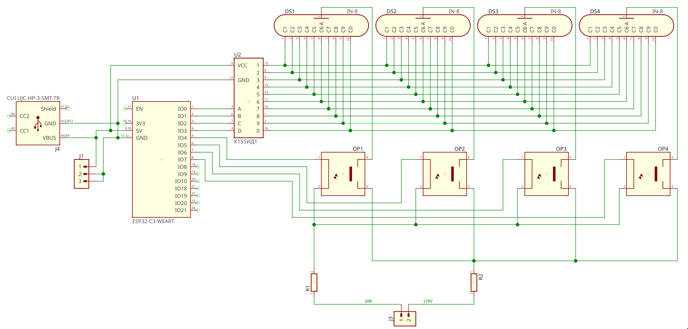
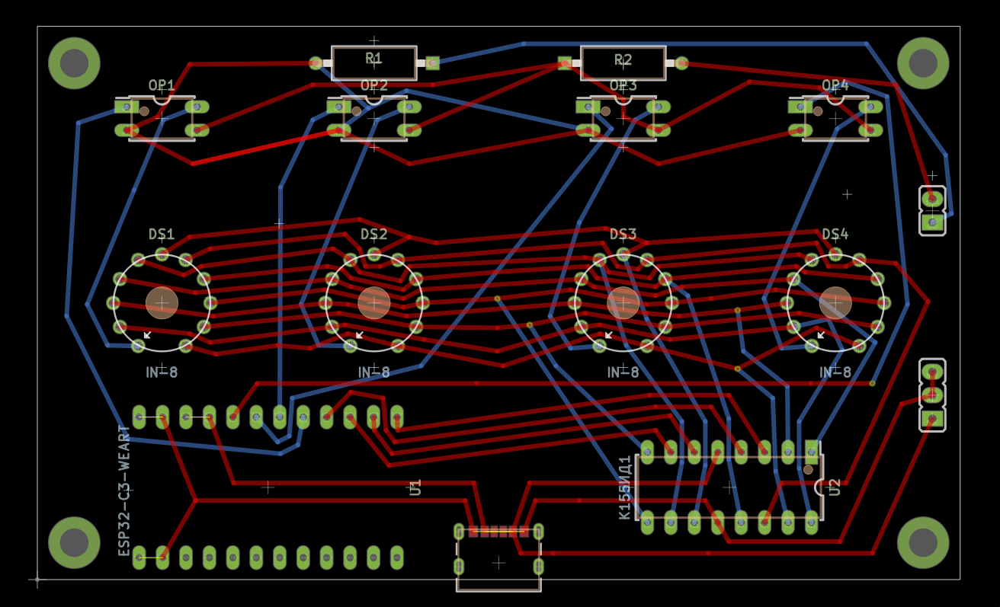

# Nixie Clock [](https://github.com/ksevelyar/nixie-clock/actions/workflows/rust_ci.yml)

## Features
- Keeps time in sync via SNTP over Wi‑Fi
- Socketed tubes for quick replacement
- 3D‑printed case
- RISC‑V mcu
- std Rust

## How it works
- On boot, connects to Wi‑Fi and starts SNTP.
- The main loop reads UNIX time, formats HH:MM (24‑hour), and multiplexes four digits.
- GPIO 0–3 carry BCD; GPIO 4–7 select the active digit (one high at a time).
- ~2 ms per digit yields a steady, flicker‑free display.

### BCD
```
0 → 0000   5 → 0101
1 → 0001   6 → 0110
2 → 0010   7 → 0111
3 → 0011   8 → 1000
4 → 0100   9 → 1001
```

## Hardware

### Schematic
[](./doc/schematic.png?raw=1)

### PCB
[](./doc/pcb.png?raw=1)

### Pinout
| GPIO | Function | Notes |
| ---- | -------- | ----- |
| 8 | Built‑in LED | lights on successful Wi‑Fi connection |
| 0–3 | BCD A–D | encodes current digit |
| 4–7 | Digit selects 1–4 | selects active digit |

## Build & Flash

```fish
nix develop

SSID="WiFi" PASS="Password" cargo run --release
```
