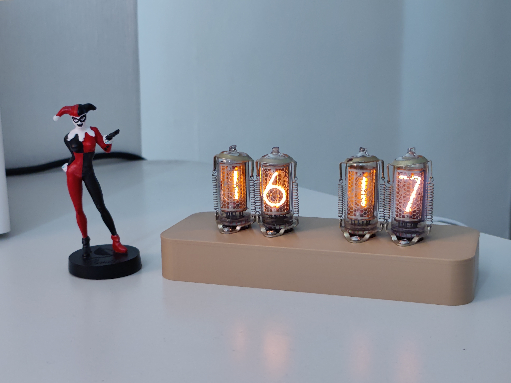
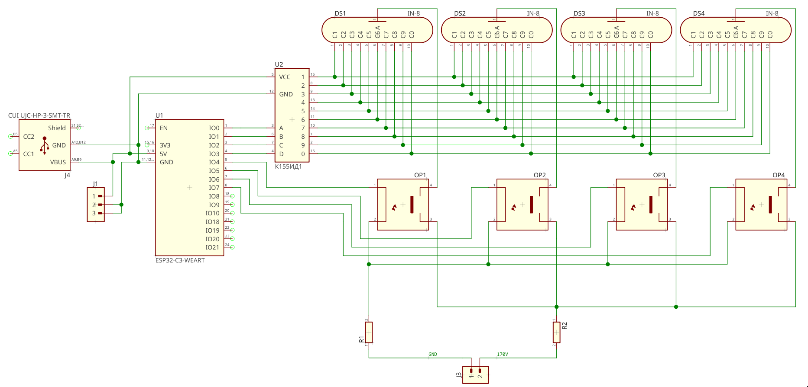
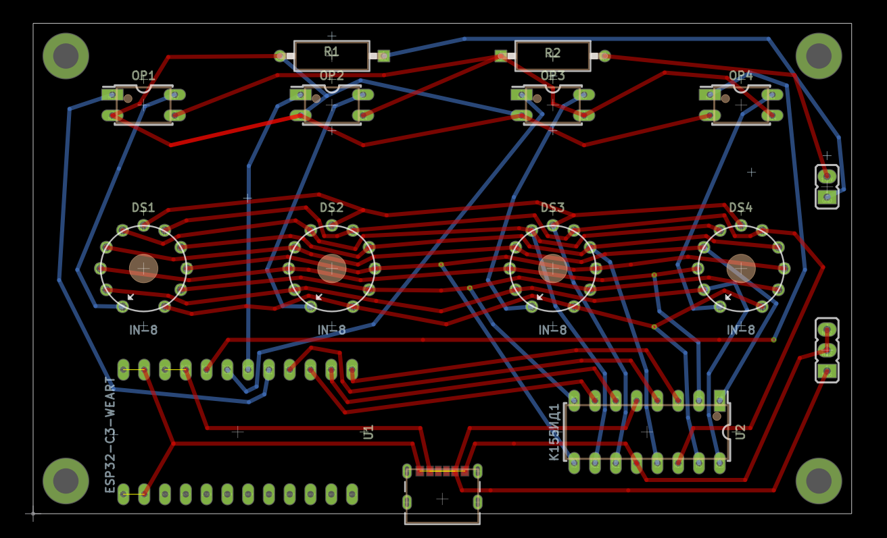

# Nixie Clock [](https://github.com/ksevelyar/nixie-clock/actions/workflows/rust_ci.yml)

[](./doc/photo.jpg)

## Features
- Keeps time in sync via SNTP over Wi‑Fi
- Socketed tubes for quick replacement
- 3D‑printed case
- RISC‑V mcu
- std Rust

## How it works
- On boot, connects to Wi‑Fi and starts SNTP.
- The main loop reads UNIX time, formats HH:MM, and multiplexes four digits.
- GPIO 0–3 carry BCD; GPIO 4–7 select the active digit (one high at a time).
- ~2 ms per digit yields flicker‑free display.

### BCD
```
0 → 0000
1 → 0001
2 → 0010
3 → 0011
4 → 0100
5 → 0101
6 → 0110
7 → 0111
8 → 1000
9 → 1001
```

## Hardware

### Schematic
[](./doc/schematic.png?raw=1)

### PCB
[](./doc/pcb.png?raw=1)

## Build & Flash

```fish
nix develop

SSID="WiFi" PASS="Password" UTC_OFFSET=180 cargo run --release
```
```
   Compiling nixie-clock v0.2.0 (/home/ksevelyar/code/nixie-clock)
    Finished `release` profile [optimized] target(s) in 0.67s
     Running `espflash flash --monitor target/riscv32imc-esp-espidf/release/nixie-clock`
[2026-03-31T20:32:43Z INFO ] Serial port: '/dev/ttyACM0'
[2026-03-31T20:32:43Z INFO ] Connecting...
[2026-03-31T20:32:43Z INFO ] Using flash stub
Chip type:         esp32c3 (revision v0.4)
Crystal frequency: 40 MHz
Flash size:        4MB
Features:          WiFi, BLE
MAC address:       60:55:f9:af:93:2c
App/part. size:    1,021,520/4,128,768 bytes, 24.74%
[2026-03-31T20:32:43Z INFO ] Segment at address '0x0' has not changed, skipping write
[2026-03-31T20:32:43Z INFO ] Segment at address '0x8000' has not changed, skipping write
[00:00:12] [========================================]     599/599     0x10000                           [2026-03-31T20:32:57Z INFO ] Flashing has completed!
Commands:
    CTRL+R    Reset chip
    CTRL+C    Exit

...

I (4346) nixie_clock: Wifi DHCP info: IpInfo { ip: 192.168.1.114, subnet: Subnet { gateway: 192.168.1.1, mask: Mask(24) }, dns: Some(192.168.1.1), secondary_dns: Some(0.0.0.0) }

...

I (4366) nixie_clock: SNTP initialized
```
